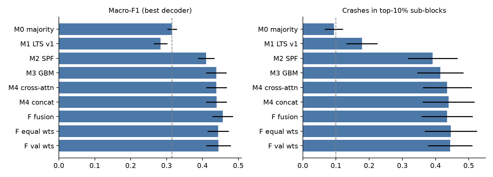
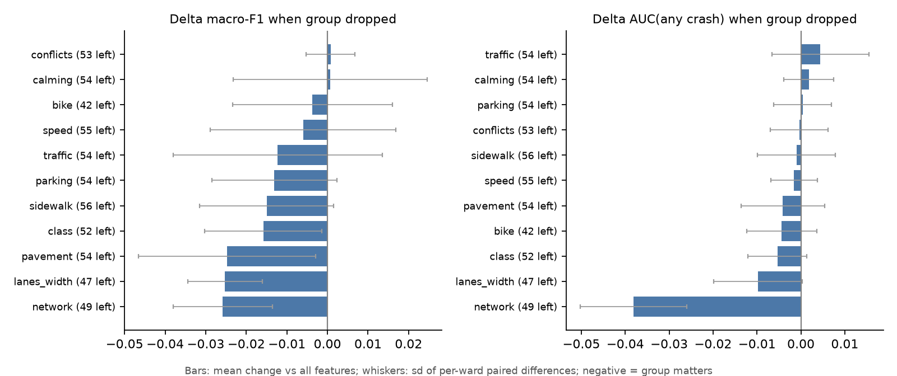
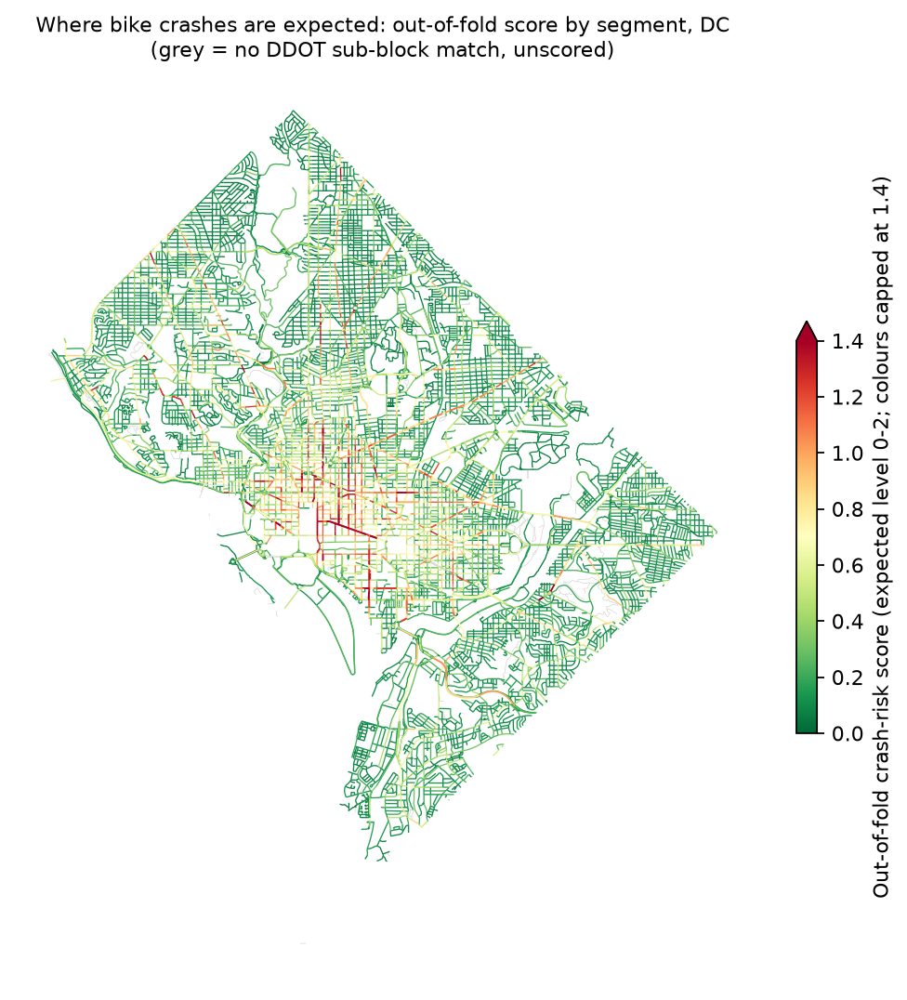
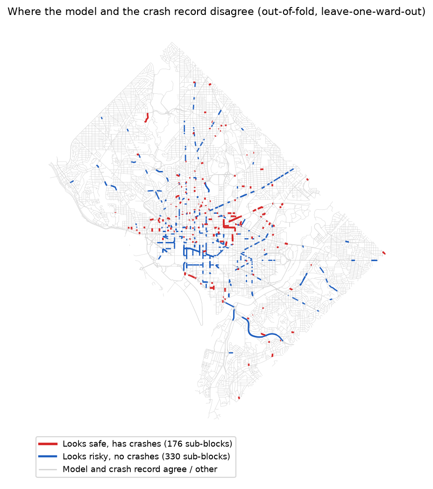

# CivicTech: Do street-design scores explain where cyclists crash in DC?

RideScore DC Challenge 1 (bike safety scores), ideas 4.2 and 4.3. Civic Tech DC x GW OSPO hackathon.

**Answer:** Street design explains part of where DC's recorded bike crashes cluster, but only part. Trained on other wards, the fused model puts **44% of a held-out ward's bike crashes in its top 10% of sub-blocks** (random gives 10%), with macro-F1 0.456 against 0.315 for always predicting "no crash". The production RideScore LTS v1 does worse than that baseline on macro-F1 (0.283): the calmest LTS-1 streets have the highest crash rate, at 6.5 crashes/km against 0.85 for LTS 2, most likely because riders concentrate there. And 176 sub-blocks that look safe by design still have 2+ crashes, mostly mid-block on local and collector streets.

---

## Why

RideScore DC colours every street by its design: speed limit, lanes, bike facility, traffic and the Level of Traffic Stress (LTS) that follows from them. Those colours describe how a street is built. Nobody has checked them against what has happened on the street. This repo does that check with five years of police-reported bike crashes, and it measures how much of the pattern of crash locations the design attributes can explain at all.

The scores are not a danger-per-ride measure. We have no exposure data (no counts of how many people ride where), so every result is about where recorded crashes happen.

## Question and hypotheses

**Question:** how far do street-design attributes (OpenStreetMap plus DDOT Roadway SubBlock, via the RideScore DC basemap snapshot of 2026-09-29) explain where cyclist crashes happen in DC?

| ID | Hypothesis | Tested by | Outcome |
|---|---|---|---|
| H1 | Design features predict crash level only modestly above baseline. | E1 | **Supported.** Macro-F1 0.456 vs 0.315 (M0); AUC 0.77; recall of the 2+ level only 32%. |
| H2 | Traffic volume, lane count and road class carry most of the signal; bike-facility type adds little on its own. | E5 | **Partly.** Network geometry (intersection legs, junction density, length) matters most, then lanes/width and pavement; class and traffic matter less (AADT is 33% filled and from 2020). Bike facility alone: within noise. |
| H3 | DDOT is more informative than OSM, but OSM adds something. | E6, E7, E8 | **Supported, weakly.** DDOT+net 0.429 / AUC 0.741 vs OSM+net 0.411 / 0.737; both 0.444. Removing the DDOT stream from M4 costs more than removing OSM. Cross-attention gives no gain over concatenation. |
| H4 | Expected-level threshold decoding improves macro-F1 over argmax on the same weights. | E3 | **Supported** for SPF (+7.9 pts), GBM (+2.1) and the fusion (+4.6). Not for M4, which already trains with an ordinal loss and balanced sampling. |
| H5 | Many "looks safe, but has crashes" blocks are at or near intersections. | Surprise analysis | **Rejected.** 79% of their crashes are mid-block (more than 15 m from an intersection), about the same as for all crashed blocks (75%). They skew to local and collector streets with fewer bike facilities. |

Wording stays at association level throughout: "where recorded crashes happen".

## Data

| Source | Used for | Licence | Link |
|---|---|---|---|
| RideScore DC basemap snapshot, 2026-09-29 (`ridescore_dc_basemap_2026-09-29.parquet`, 28,978 road segments, OSM tags joined to DDOT Roadway SubBlock attributes) | Features, geometry, the join key `dc_subblockkey` | ODbL, "© OpenStreetMap contributors"; DDOT part CC BY 4.0 | https://huggingface.co/datasets/EChODatascience/ridescore-dc-basemap |
| DDOT Roadway SubBlock (carried inside the snapshot as `dc_*` columns) | Speed limit, lanes, width, AADT, parking, bike facility, pavement, sidewalk | CC BY 4.0, Government of the District of Columbia / DDOT | https://opendata.dc.gov/datasets/DCGIS::roadway-subblock |
| Crashes in DC (MPD / DDOT), layer 24 of `Public_Safety_WebMercator` | Labels only | CC BY 4.0, Government of the District of Columbia / MPD / DDOT | https://opendata.dc.gov/datasets/crashes-in-dc/about (API: https://maps2.dcgis.dc.gov/dcgis/rest/services/DCGIS_DATA/Public_Safety_WebMercator/MapServer/24) |

Crashes are never used as features. They give the label and nothing else.

## Method

| Step | Choice |
|---|---|
| Unit | DDOT sub-block. The 28,978 snapshot segments collapse to **19,554 sub-blocks**; `dc_*` values are constant inside one. |
| Label | Bike-involved crashes (`TOTAL_BICYCLES > 0`) per sub-block, 2021-09-30 to 2026-09-29 (3,089 crashes), binned **0 / 1 / 2+**: 17,826 / 1,203 / 525 sub-blocks. |
| Features | Eleven groups from three sources: DDOT (`ddot_*`), OSM (`osmf_*`), network shape (`net_*`). Groups: speed, lanes_width, parking, bike, traffic, class, conflicts, calming, pavement, sidewalk, network. Ward, coordinates and anything crash-derived are excluded. |
| Split | Leave-one-ward-out. Test = ward w, validation = the next two wards in cyclic order, train = the other five. Every sub-block gets one out-of-fold (OOF) prediction. |
| Reference | M0, the majority class. Every number is read against it. |
| Decoding | Expected level `mu = sum_k k * P(k)`; two thresholds fitted on validation wards to maximise macro-F1 (coarse 0.05 grid, then 0.01). Compared with argmax and a logit bias. |
| Imbalance | Inverse-sqrt class weights for the gradient boosting model. |
| Fusion | Fixed-weight late fusion of probabilities; weights from `config.yaml`, not tuned on test wards. |

Model ladder:

| Model | What it is |
|---|---|
| M0 | Majority class (always 0) |
| M1 | Production RideScore LTS v1 (`ridescore.models.ridescore_v1.lts`). LTS 1-2 maps to 0, LTS 3 to 1, LTS 4 to 2; the score is the LTS level. This is also experiment E2. |
| M2 | Safety Performance Function: negative binomial regression of crash count with offset log(length) (Poisson if NB does not converge) |
| M3 | Gradient boosting (histogram GBM, native missing values, 3 fits averaged) |
| M4 | OSM-to-DDOT cross-attention Transformer (AVT-CA / AVB-Engage fusion block on FT-Transformer feature tokens): d=32, 4 heads, 2 exchanges, source dropout 0.15, ordinal loss λ=0.15, 3 seeds, GPU. M4-concat replaces cross-attention with self-attention over the concatenated tokens (E8). |
| F | Late fusion, 0.4 M4 + 0.4 M3 + 0.2 M2 (the AVB-Engage-style fixed weights; not tuned on test wards) |

Method lineage: AVT-CA (audio-visual cross-attention) -> AVB-Engage (our ordinal engagement paper) -> this project, which reuses the ordinal toolkit (threshold decoding fitted on validation, class weighting, fixed-weight late fusion, ward-independent CV, majority-class reference) on a different problem.

Experiments: E1 ladder, E2 production LTS vs crashes, E3 decoders, E5 feature-group ablation, E6 DDOT vs OSM, E7 inference-time source ablation of M4, E8 cross-attention vs concatenation, E9 fusion weights, E10 label variants (injury-only, mid-block-only, block-level), E11 drop weak OSM-to-DDOT matches.

## Results

All numbers are mean ± sd over the 8 leave-one-ward-out folds, on wards the model never saw in training. Thresholds and fusion weights come from validation wards only. Full tables: `output/tables.md`.

**E1, ladder (M0 to F).** Top-10% capture = share of the test ward's crashes in the 10% of sub-blocks with the highest score (random = 10%).

| Model | Decoder | Macro-F1 | Recall lvl 2 | AUC any crash | AUC 2+ crashes | Top-10% capture | Top-10% capture (by length) | Accuracy |
|---|---|---|---|---|---|---|---|---|
| M0 majority | argmax | 0.315 ± 0.013 | 0.000 ± 0.000 | 0.500 ± 0.000 | 0.500 ± 0.000 | 0.094 ± 0.027 | 0.092 ± 0.027 | 0.900 |
| M1 RideScore LTS v1 | argmax | 0.283 ± 0.019 | 0.635 ± 0.117 | 0.623 ± 0.058 | 0.662 ± 0.087 | 0.178 ± 0.047 | 0.155 ± 0.051 | 0.548 |
| M2 SPF (neg. binomial) | thresholds | 0.410 ± 0.023 | 0.216 ± 0.095 | 0.739 ± 0.014 | 0.833 ± 0.055 | 0.391 ± 0.075 | 0.197 ± 0.051 | 0.834 |
| M3 gradient boosting | thresholds | 0.439 ± 0.028 | 0.263 ± 0.110 | 0.743 ± 0.032 | 0.830 ± 0.070 | 0.414 ± 0.070 | 0.368 ± 0.063 | 0.839 |
| M4 OSM-DDOT cross-attention | thresholds | 0.432 ± 0.036 | 0.310 ± 0.158 | 0.770 ± 0.032 | 0.864 ± 0.058 | 0.435 ± 0.074 | 0.378 ± 0.077 | 0.811 |
| M4-concat (no cross-attention) | thresholds | 0.438 ± 0.036 | 0.318 ± 0.181 | 0.772 ± 0.029 | 0.867 ± 0.057 | 0.439 ± 0.078 | 0.388 ± 0.074 | 0.824 |
| F fusion (fixed weights) | thresholds | 0.456 ± 0.029 | 0.324 ± 0.107 | 0.769 ± 0.029 | 0.863 ± 0.055 | 0.435 ± 0.077 | 0.374 ± 0.065 | 0.832 |
| F fusion (equal weights) | thresholds | 0.443 ± 0.030 | 0.330 ± 0.148 | 0.769 ± 0.026 | 0.863 ± 0.054 | 0.446 ± 0.079 | 0.359 ± 0.063 | 0.836 |
| F fusion (val-selected weights) | thresholds | 0.445 ± 0.034 | 0.350 ± 0.130 | 0.769 ± 0.025 | 0.862 ± 0.053 | 0.444 ± 0.067 | 0.369 ± 0.072 | 0.827 |




**M2 SPF coefficients** (negative binomial, full table, offset log length; `output/spf_coefficients.csv`). Rates are per metre of sub-block, and IRR is the incidence rate ratio:

| Term | IRR | 95% CI |
|---|---|---|
| log AADT (+1) | 1.19 | 1.04–1.36 |
| AADT missing | 0.66 | 0.52–0.83 |
| travel lanes (+1) | 1.08 | 1.02–1.14 |
| posted speed (+1 mph) | 0.96 | 0.95–0.98 |
| DDOT bike facility rank (+1) | 1.51 | 1.39–1.64 |
| FHWA class 3, other principal arterial (vs other) | 8.4 | 5.0–14.0 |
| FHWA class 4, minor arterial | 6.8 | 4.2–11.0 |
| FHWA class 5, major collector | 3.5 | 2.2–5.8 |

Read these as associations confounded by exposure. Bike facilities and lower speed limits go with *more* recorded crashes because that is where people ride (downtown, on bike routes), not because they cause crashes.

**E3, decoders (argmax vs logit bias vs thresholds):**

| Model | argmax | logit bias (val) | expected-level thresholds (val) |
|---|---|---|---|
| M2 SPF (neg. binomial) | 0.331 | 0.408 | 0.410 |
| M3 gradient boosting | 0.418 | 0.432 | 0.439 |
| M4 OSM-DDOT cross-attention | 0.431 | 0.439 | 0.432 |
| M4-concat (no cross-attention) | 0.428 | 0.439 | 0.438 |
| F fusion (fixed weights) | 0.410 | 0.436 | 0.456 |

**E5, feature-group ablation (drop one group from M3; 1-fit GBM, so the base is 0.444).** Network geometry is the only group whose removal clearly hurts AUC (−0.038). Lanes/width and pavement cost about 0.025 macro-F1. Bike facility, speed, calming and conflicts are within noise; per-ward sd is about 0.03.



**E6, DDOT vs OSM vs both (each with network features):**

| Sources | Features | Macro-F1 | AUC any | AUC 2+ | Top-10% capture |
|---|---|---|---|---|---|
| all | 57 | 0.444 ± 0.029 | 0.744 | 0.829 | 0.414 |
| DDOT + network | 42 | 0.429 ± 0.031 | 0.741 | 0.820 | 0.414 |
| OSM + network | 22 | 0.411 ± 0.039 | 0.737 | 0.821 | 0.361 |
| DDOT + OSM (no network) | 50 | 0.410 ± 0.025 | 0.704 | 0.778 | 0.352 |
| network only | 7 | 0.378 ± 0.028 | 0.632 | 0.705 | 0.254 |

**E7 / E8, M4 source ablation and concat variant** (test macro-F1 with thresholds refit on validation for each variant):

| Variant | Macro-F1 | AUC any |
|---|---|---|
| M4 cross-attention (OSM ↔ DDOT) | 0.432 ± 0.036 | 0.770 |
| M4-concat (self-attention, no cross-attention) — E8 | 0.435 ± 0.036 | 0.772 |
| M4, OSM stream blanked at inference — E7 | 0.427 ± 0.031 | 0.762 |
| M4, DDOT stream blanked at inference — E7 | 0.418 ± 0.031 | 0.753 |

The cross-attention block does not beat plain concatenation here, so we report that honestly. Blanking either source costs little, because source dropout in training (p = 0.15) taught the model to cope. DDOT is the stream it leans on more.

**E9, fusion weights (fixed vs equal vs validation-selected):**

Fixed weights 0.4/0.4/0.2: macro-F1 **0.456 ± 0.029**. Equal weights: 0.443 ± 0.030. Validation-selected: 0.445 ± 0.034. AUC is 0.769 for all three. The fixed weights are not tuned on test wards, and the differences are within one fold-sd.

**E10 / E11, label variants and weak matches:**

| Label | Unit | Macro-F1 | AUC any | AUC 2+ |
|---|---|---|---|---|
| any bike crash (primary) | sub-block | 0.444 ± 0.029 | 0.744 | 0.829 |
| cyclist injured or killed | sub-block | 0.425 ± 0.041 | 0.736 | 0.846 |
| mid-block only (> 15 m from intersection) | sub-block | 0.419 ± 0.032 | 0.739 | 0.819 |
| any bike crash | DDOT block (13,068) | 0.428 ± 0.042 | 0.706 | 0.800 |

E11: dropping the 100 weak-match sub-blocks changes macro-F1 from 0.444 to 0.430 and AUC from 0.744 to 0.743, within noise. Conclusions hold.

**E2, production LTS v1 against recorded crashes:**

| LTS | Sub-blocks | Share of network km | Share of crashes | Crashes per km | Share with ≥ 1 crash |
|---|---|---|---|---|---|
| 1 (calmest) | 394 | 1.9% | 7.9% | 6.51 | 27.2% |
| 2 | 10,882 | 51.2% | 27.7% | 0.85 | 5.1% |
| 3 | 2,250 | 11.9% | 7.9% | 1.03 | 5.7% |
| 4 (most stressful) | 6,028 | 35.0% | 56.5% | 2.53 | 15.6% |

LTS 1 is mostly protected tracks and trails, where riders concentrate. Without exposure data this reads as "crashes happen where people ride", not "protected lanes are unsafe".

**Per ward:**

| Test ward | Sub-blocks | Level-2 | Macro-F1 | AUC any | Top-10% capture |
|---|---|---|---|---|---|
| 1 | 1296 | 104 | 0.514 | 0.770 | 0.449 |
| 2 | 2250 | 185 | 0.453 | 0.761 | 0.309 |
| 3 | 2886 | 12 | 0.449 | 0.810 | 0.568 |
| 4 | 3462 | 37 | 0.453 | 0.765 | 0.443 |
| 5 | 3078 | 68 | 0.420 | 0.785 | 0.429 |
| 6 | 1986 | 87 | 0.459 | 0.737 | 0.459 |
| 7 | 2681 | 11 | 0.428 | 0.728 | 0.356 |
| 8 | 1915 | 21 | 0.473 | 0.801 | 0.467 |

Wards 3 and 7 have only 12 and 11 level-2 sub-blocks, so their per-level F1 is noisy. Ward 2 (downtown) has the lowest top-10% capture: crashes there are spread over many similar-looking blocks.

**Risk map (OOF expected level, green to red):**



**Surprise map.** "Looks safe but has crashes" is a sub-block with 2+ crashes that the model placed in level 0 or the bottom half of scores. "Looks risky but no crashes" is the reverse. These are disagreements between the model and the record, not verdicts on a street. Counts and breakdowns by intersection share, `net_max_legs`, class, bike facility, ward and match quality:



| | Looks safe, has crashes | Looks risky, no crashes | All level-2 |
|---|---|---|---|
| Sub-blocks | 176 (450 crashes) | 330 | 525 |
| Crashes mid-block (> 15 m) | 79% | — | 77% |
| Local street (FHWA 7) | 34% | 1% | 12% |
| Major collector (FHWA 5) | 24% | 10% | 13% |
| Junction with ≥ 4 legs | 74% | 92% | 83% |

"Looks safe, but has crashes" blocks are mostly mid-block crashes on local and collector streets with fewer bike facilities. Examples: 1st St NW at K St (Ward 6, 9 crashes), Eastern Ave NE at Southern Ave (Ward 7, 8), Dupont Circle (Ward 2, 6). Full list: `output/surprise_examples.csv`.

"Looks risky, but no crashes" blocks are busy arterials that look exactly like the arterials that do have crashes. The design data cannot tell them apart; the difference is likely ridership or chance.

## Hand-in file

`output/crash_risk_by_segment.parquet`: one row per snapshot segment (28,978 rows, unique `(osm_u, osm_v, osm_key)`), keyed like the other RideScore hand-ins.

| Column | Meaning |
|---|---|
| `osm_u`, `osm_v`, `osm_key` | OSM edge key |
| `snapshot_date` | `2026-09-29` |
| `dc_subblockkey` | DDOT sub-block the segment belongs to (null if unmatched) |
| `crash_risk_level` | Decoded level in {0, 1, 2}; from the out-of-fold prediction for the sub-block's ward |
| `crash_risk_score` | Expected level in [0, 2]. Higher means more recorded crashes expected. Not a probability and not per-ride risk. |
| `crash_count_5yr` | Bike-involved crashes matched to the sub-block, 2021-09-30 to 2026-09-29 |
| `scored` | False for the 1,399 segments (4.8%) with no sub-block match; their level and score are empty |

Attribution (OSM, DDOT, MPD) is stored in the Parquet metadata.

## How to reproduce

```bash
python3 -m venv .venv --system-site-packages     # reuses pandas, sklearn, pyarrow, torch, pytest from the base env
.venv/bin/pip install geopandas statsmodels matplotlib pyyaml \
  "ridescore @ git+https://github.com/civictechdc/ridescoredc-models@develop"

# put the snapshot at ~/ridescore-data/ridescore_dc_basemap_2026-09-29.parquet (paths: config.yaml)

.venv/bin/python scripts/01_build_dataset.py   # fetch + cache crashes, build labels and the sub-block table
.venv/bin/python scripts/02_ladder.py          # E1, E3, E9: M0 -> M1 -> M2 -> M3 -> F
.venv/bin/python scripts/03_ablations.py       # E5, E6, E10, E11
.venv/bin/python scripts/04_findings.py        # surprise analysis, maps, hand-in Parquet
python scripts/05_xattn.py                     # M4, E7, E8 (GPU env; writes output/xattn_probs.parquet)
.venv/bin/python scripts/06_tables.py          # markdown tables -> output/tables.md

.venv/bin/python -m pytest -q
```

`01_build_dataset.py` prints the sanity numbers to check against: 19,554 sub-blocks; label counts 17,826 / 1,203 / 525; crash match rate 88.8%; 142 sentinel ("Route not found") crashes. M0 scores 0.315 macro-F1. `05_xattn.py` runs in the separate GPU env (torch + CUDA); run it before `02_ladder.py` to include M4 in the fusion, then rerun `04_findings.py`. `06_tables.py` renders `output/tables.md`.

## Limitations

- **No exposure.** There are no ridership or bike-count data, so busy streets can look risky just because more people ride them. Results are about recorded crashes, not risk per ride.
- **Associations, not causes.** A feature that predicts crashes is not shown to cause them.
- **Rare events.** Only 525 sub-blocks are level 2+. Ward 3 has 12 and Ward 7 has 11, so per-ward scores are noisy.
- **Police-reported only.** Crashes that were not reported, and near misses, are absent.
- **Crash-to-street assignment.** Intersection crashes are assigned to a sub-block by the source data; label variants (E10) test how much this matters.
- **AADT is a pandemic year.** Where `dc_AADT` exists (42% of matched rows) its year is 2020 in every case.
- **Pavement data covers 2019-2023.**
- **Unmatched crashes.** 11% of crashes (347 of 3,089) do not match a snapshot sub-block: 142 are "Route not found" and the rest sit on sub-blocks outside the snapshot.
- **Equity caveat.** The loss is uneven. Among crashes with a location, Wards 7 and 8 lose 18-21% against 3% in Ward 1 (22-23% counting the unlocated ones), so labels there are more likely to be missing and the model is trained on less of the truth.
- **Unscored segments.** 4.8% of snapshot segments (1,399) have no sub-block match and are not scored.
- **Trend.** Bike crashes rose from 2022 to 2025; the five-year count pools different years.
- **Not a replacement for LTS.** This is a check on design scores, not a new safety rating.

## Claims discipline

- Say "where crashes happen" or "where recorded crashes are expected". Never "danger per ride", "unsafe street" or "safe street".
- Every result is read against M0.
- Surprise maps show model-record disagreement, not blame.
- No causal language.
- Ward, coordinates and crash-derived values are never features; thresholds and weights are fitted on validation wards only.

## Credits and licence

- Code: MIT (see `LICENSE`).
- Data outputs (`output/`, including the hand-in Parquet): ODbL, because they derive from OpenStreetMap. "© OpenStreetMap contributors". DDOT and Crashes in DC data: CC BY 4.0, Government of the District of Columbia / DDOT / MPD.
- RideScore DC: https://github.com/civictechdc/ridescoredc-models (production LTS v1 used as M1).
- Method lineage: AVT-CA, AVB-Engage.
- Author: Yuvraj Gupta, for the Civic Tech DC x GW OSPO hackathon.
