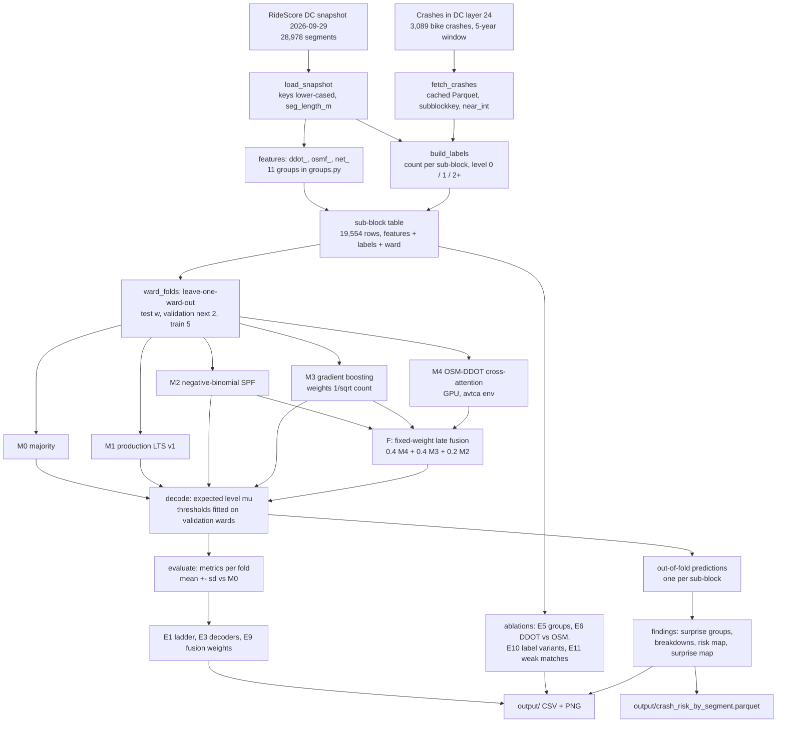

# Architecture

Pipeline from the RideScore DC snapshot and the Crashes in DC layer to the hand-in Parquet. M4 landed in time and is part of the fusion (0.4 M4 + 0.4 M3 + 0.2 M2).

## Pipeline

Leakage guard: ward, coordinates and crash-derived values never enter `FEAT`; thresholds and fusion weights are fitted on validation wards only.

## Components

| Component | Module | Role |
|---|---|---|
| Config | `src/config.py`, `config.yaml` | `load_config()` returns the config dict with expanded paths |
| Snapshot loader | `src/data/load_snapshot.py` | `load_snapshot(cfg)`: GeoDataFrame, lower-cased keys, `seg_length_m` in EPSG:26985 |
| Crash fetcher | `src/data/fetch_crashes.py` | `fetch_crashes(cfg, refresh=False)`: paginated API pull, cached Parquet; adds `subblockkey`, `blockkey`, `located`, `injured`, `near_int` |
| Labels | `src/labels.py` | `build_labels(...)`: `crash_count`, `level` (0/1/2+), variants `level_injury`, `level_midblock`; `join_report(...)` counts unmatched and sentinel crashes |
| DDOT features | `src/features/ddot.py` | `ddot_*`: bike-best ranking, speed from OB limit, log AADT, truck share, width per lane |
| OSM features | `src/features/osm.py` | `osmf_*`: parsed maxspeed and lanes, normalised cycleways, length-weighted aggregation, `osmf_has_parallel_track` |
| Network features | `src/features/network.py` | `net_*`: legs, junctions per 100 m, endpoint arterial |
| Feature groups | `src/features/groups.py` | `FEATURE_GROUPS` (11 groups) and `SOURCES` (ddot, osm, net) for ablations |
| Table builder | `src/features/build.py` | `build_table(cfg)`: one row per sub-block with features, labels, ward, `weak_match`, `length_m` |
| Split | `src/split.py` | `ward_folds(ward, n_val=2)`: leave-one-ward-out `Fold`s, asserts no ward plays two roles |
| Decoding | `src/decode.py` | `expected_level`, `fit_thresholds` (macro-F1), `decode`, `fit_logit_bias`, argmax |
| Metrics | `src/evaluate.py` | `metrics(...)` per fold, `summarise(...)` mean +- sd |
| Baselines | `src/models/baselines.py` | M0 majority, M1 production LTS v1 |
| SPF | `src/models/spf.py` | M2: NB (Poisson fallback) with offset log(length), probabilities via pmf |
| GBM | `src/models/gbm.py` | M3: histogram GBM, native missing values, inverse-sqrt weights, 3 fits averaged |
| Fusion | `src/models/fusion.py` | `fuse(...)` and the weight grid for E9 |
| Cross-attention | `src/models/xattn.py` | M4: tokeniser, OSM<->DDOT cross-attention, concat variant |
| Experiment runner | `src/experiments.py` | `run_cv(...)`: per-fold metrics and OOF predictions for all decoders |
| Scripts | `scripts/01_build_dataset.py` to `05_xattn.py` | Build table; ladder (E1, E3, E9); ablations (E5, E6, E10, E11); findings and hand-in; M4 (E7, E8) |
| Tests | `tests/test_labels.py`, `test_osm_parsing.py`, `test_decode.py`, `test_split.py` | Unit tests on synthetic tables |

## Key interfaces

- Join key: `dc_subblockkey`, normalised with `.str.strip().str.lower()`.
- Feature prefixes: `ddot_`, `osmf_`, `net_`.
- Hand-in row key: `(osm_u, osm_v, osm_key)` plus `snapshot_date = 2026-09-29`.
- Data on disk (outside the repo): `~/ridescore-data/` holds the snapshot, the crash cache and `subblock_table.parquet`.
